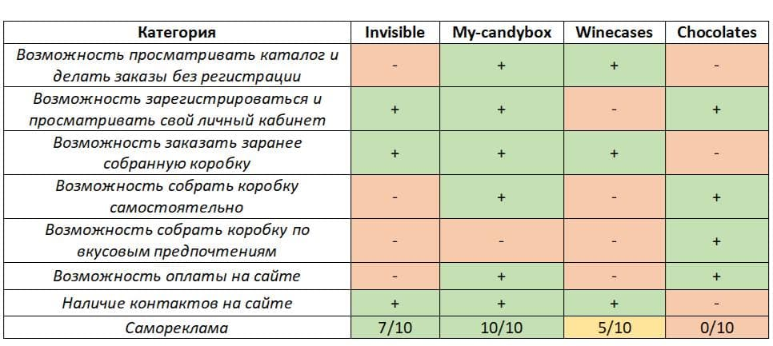

# chocolate-shop
Specialized shop for selling home-made chocolates.

# Анализ задания и обзор аналогов

## **1. High-Level Overview:** ##

  Проект представляет собой специализированный интернет магазин по продаже шоколада, его целевая аудитория - люди любящие сладкое в большом объеме. Удовлетворяемые потребности - голод, желание чего-то сладкого.
  
## **2. Высокоуровневое описание деталей:** ##

  Основная фишка проекта - тест, позволяющий собрать коробку из четырех вкусов шоколада, основывающийся на предпочтениях заказчика, не выбирая каждый вкус отдельно (такая возможность тоже имеется).
  
  Всего с проектом могут взаимодействовать пятеро сущностей: **гость**, **пользователь**, **работник склада**, **повар** и **администратор**.
  
  **Гостю** доступны следующие действия:
  
  - вход;
  - регистрация.

  **Пользователю** доступны следующие действия:
  
  - сбор заказа с помощью теста;
  - сбор заказа "вручную";
  - оформление заказа;
  - просмотр личного кабинета со своими заказами и их статусом.
 
  **Работнику склада** доступны следующие действия:
  
  - просмотр всех заказов со статусом "Оплачено";
  - просмотр таблицы с доступными на складе вкусами;
  - обновление таблицы со вкусами, которые необходимо приготовить;
  - обновление таблицы с доступными на складе вкусами;
  - обновление статуса заказа на "Собран".

  **Повару** доступны следующие действия:
  
  - просмотр таблицы со вкусами, которые необходимо приготовить;
  - одновременное обновление таблицы со вкусами которые необходимо приготовить и таблицы с доступными на складе вкусами;
  
  **Администратору** доступны следующие действия:
  
  - просмотр всех заказов со статусом "Оформлен";
  - обновление статуса заказа на "Оплачен";
  - обновление статуса заказа на "Отправлен".
  
  Веб-приложение будет работать с БД четырьмя таблицами **USERS**, **ORDERS**, **COOKING** и **CHOCOLATES**, иметь слоистую структуру и использовать MVC-фреймворк.
  
## **3. Описание аналогов:** ##

  - **Сервис по доставке коробок со сладостями и снеками https://my-candybox.ru/**

    Имеется возможность заказать коробку из каталога или собрать свою, соответственно имеются два каталога, на сайте также присуствуют отзывы и прочая самореклама, контакты. Будучи гостем можно и сделать заказ, и просматривать каталог. Присутствует бонусная программа для зарегистрировавшихся пользователей, присутствует оплата онлайн. 
    
  - **Сервис по доставке коробок с вином https://www.invisible.ru/**
    
    Для просмотра каталога и заказа необходимо войти/зарегистрироваться, каталог разделен на отдельные категории в каждой из которой присутствуют заранее собранные коробки с вином. Оплата заказа происходит не на сайте, необходимо чтобы сотрудник связался по указанному номеру телефона. Также присутсвует самореклама, включая блог, и контакты.
    
  - **Сервис по доставке коробок с вином с возможностью подписки https://wine.winecases.me/**

    На сайте нет возможности зарегистрироваться, оплата заказа также происходит на сайте. Присутствует несколько каталогов с заранее собранными коробками, также имеется возможность оформить подписку и получать сюрприз коробки. Много саморекламы, контакты.
    
 ## **4. Сравнительная таблица аналогов:** ##
    
    
  
  
  
